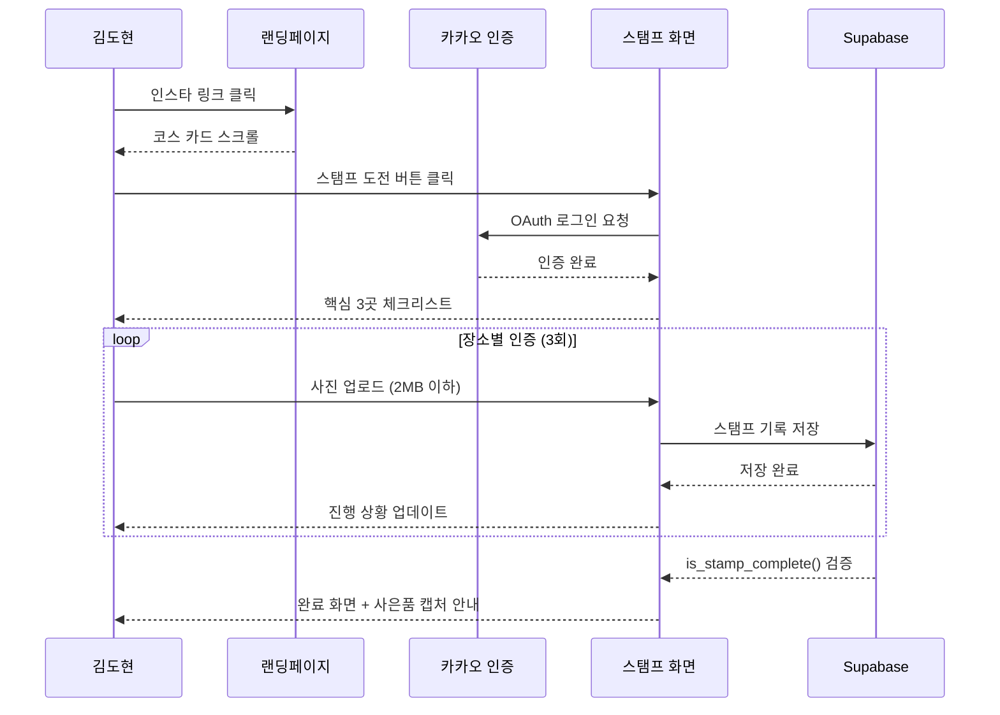
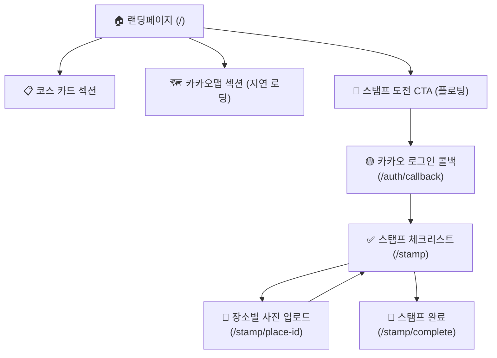
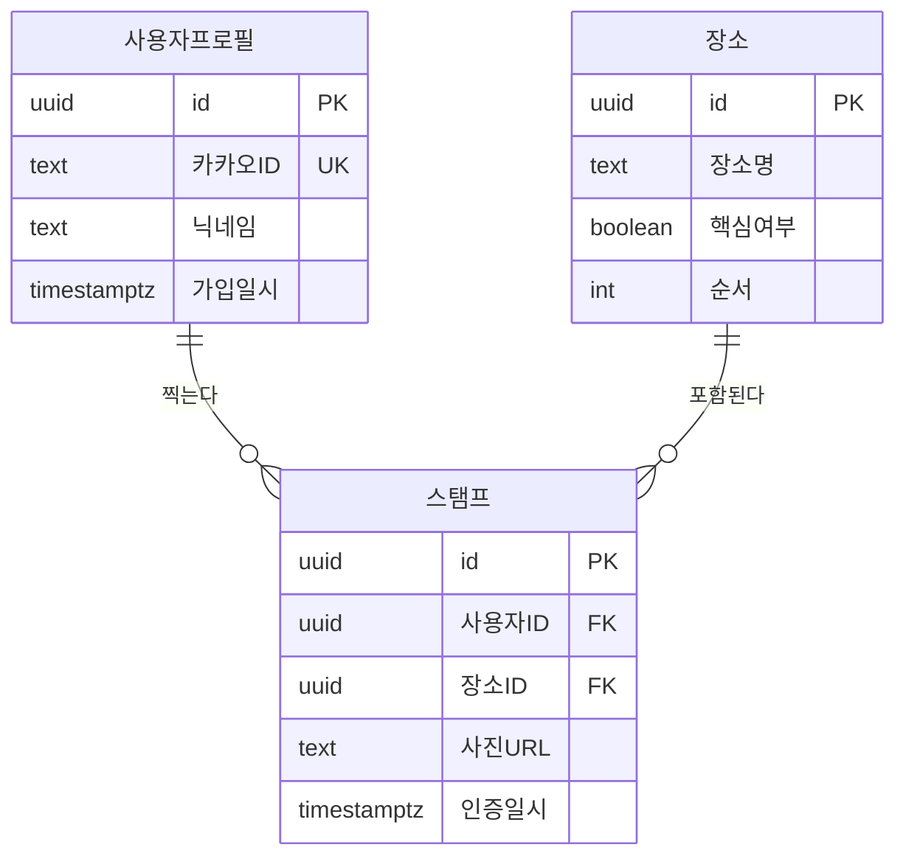
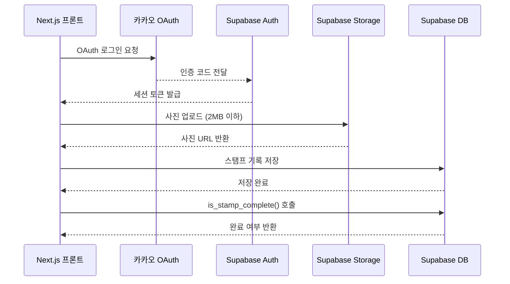

# 구로 반나절 PRD

> 작성일: 2026-06-02 · 버전: v1.0
> 다음 단계: FRD (`prd-구로반나절-20260602-handoff.md` 참조)

---

## 1. 한 문단 요약

구로 반나절은 서울 구로구의 이색 반나절 코스(넷마블 게임 박물관 → G밸리 산업 박물관 → 남구로 시장 → 중국 베이커리)를 카드뉴스 감성으로 큐레이션하고, 카카오 로그인 기반 스탬프 인증으로 지역 상권 방문을 완성시키는 관광 안내 홈페이지다. 핵심 3곳을 사진 인증하면 중국 호떡 사은품을 받는 게임화 장치가 재방문과 SNS 공유를 유도한다.

1인이 Next.js 14 + Supabase + Vercel 스택으로 3개월 안에 구현하며, 인스타그램 카드뉴스와 네이버·구글 검색 두 채널로 트래픽을 확보한다. 인프라 비용은 전액 무료 플랜으로 운영되고, 오픈 30일 내 월 UV 1,000명·스탬프 완료율 5%가 검증 목표다. 주요 리스크는 SNS 채널 유입 부재와 지역 사업자 협업 이탈이며, 각각 인스타 채널 사전 연동과 MVP 오픈 전 호떡집 구두 협의로 대응한다.

---

## 2. 왜 만드는가

### 2.1 현재 어떻게 일하고 있나

구로구 반나절 코스를 찾는 사람은 네이버 블로그를 검색한다. "구로 맛집", "남구로 시장 먹거리", "넷마블 게임 박물관 후기" 키워드로 포스팅 5~10개를 읽고 직접 코스를 조합하는 데 30~60분이 걸린다. 이동 시간·예산·동선이 각각 다른 포스팅에 흩어져 있어 한 번에 파악하기 어렵다.

### 2.2 무엇이 답답한가

블로그 정보는 파편화되어 있고 최신 여부가 불확실하다. 코스를 조합하다 귀찮아져 "그냥 집에 있자"로 끝나거나, 기대 없이 갔다가 "생각보다 볼 게 없었다"는 경험으로 이어진다. 구로구 관광 콘텐츠의 잠재력이 정보 접근성 문제로 소비되지 못하고 있다.

### 2.3 우리가 어떻게 바꾸는가

구로 반나절은 코스·동선·예산·지도를 한 페이지에 정리해 "오늘 오후 이거 그대로 따라가면 된다"는 확신을 준다. 스탬프 게임화는 방문을 이벤트로 만들어 완료 후 SNS 공유와 재방문을 유도하고, 지역 사업자(중국 베이커리)와 사은품 협업으로 오프라인 방문을 홈페이지 경험에 연결한다.

---

## 3. 누가 쓰는가

구로 반나절의 핵심 사용자는 서울에서 일하는 28~33세 직장인이다. 해외여행 욕구는 있지만 예산과 시간이 맞지 않아 "서울 안에서 색다른 경험"을 찾는다. 인스타그램 피드에서 카드뉴스를 보다가 링크를 클릭하거나, 주말 코스를 찾다 검색에서 유입된다.

### 3.1 핵심 페르소나

| 변수 | 값 |
|---|---|
| 이름 | 김도현 (가명) |
| 직업·역할 | 서울 IT·사무직 3~7년차 |
| 연령대 | 28~33세 |
| 디지털 숙련도 | 보통형 — 카카오톡·인스타·네이버지도 능숙, 낯선 UI 즉시 이탈 |
| 주 사용 기기 | 모바일 (아이폰 or 갤럭시), 세로 화면 |
| 사용 맥락 | 주말 오전, 인스타 피드 보다가 카드뉴스 링크 클릭 |
| 핵심 동기 | 해외여행 대신 "서울 안의 이색 체험". 총 예산 5~6만원 이내 |
| 좌절 경험 | 블로그 5개 뒤져도 코스 못 짜고 포기한 경험 반복 |
| 의사결정 기준 | "오늘 바로 갈 수 있나?" + "얼마 들어?" |

### 3.2 비대상 사용자

외국인 관광객(한국어 전용 서비스), 향신료에 민감하거나 어린아이 동반 가족(PPT에서 명시적 비추천 분류), 코드·UI를 직접 수정할 관리자(Supabase 대시보드로 대체).

---

## 4. 사용자 시나리오

구로 반나절이 어떻게 사용되는지 세 가지 상황으로 보여준다.

### 시나리오 1: 주말 이색 코스 탐색 (Happy Path)

토요일 오전 11시, 김도현은 침대에서 인스타를 보다가 구로 반나절 카드뉴스를 발견한다. 링크를 누르자 코스 소개가 카드뉴스처럼 스크롤로 펼쳐진다. 넷마블 게임 박물관, G밸리 산업 박물관, 남구로 시장이 이동 시간·예산과 함께 정리되어 있고 "총 예산 5만원, 소요 4시간" 배지가 눈에 들어온다. "오늘 오후에 갈 수 있겠다"는 확신이 생기고, 스탬프 도전 버튼을 눌러 카카오로 1초 만에 로그인한다. 핵심 3곳 체크리스트를 들고 오후 1시에 출발해 저녁 5시에 호떡집에서 마지막 스탬프를 완료하고 사은품을 받는다.



### 시나리오 2: 검색 유입 후 정보만 수집

평일 점심시간, 다른 직장인이 "구로 반나절 코스"를 네이버에서 검색해 홈페이지에 들어온다. 코스를 훑어보고 지도 섹션에서 이동 동선을 확인한다. 오늘은 시간이 없어 스탬프 참여는 안 하고 코스를 메모해 간다. 다음 주말에 친구와 함께 방문한다.

### 시나리오 3: 카카오 로그인 팝업 차단 예외

스탬프 도전 버튼을 눌렀는데 카카오 로그인 팝업이 열리지 않는다. 브라우저 팝업 차단 설정 때문이다. 화면에 "팝업이 차단됐어요. 아래 방법으로 허용해 주세요"라는 안내와 허용 방법 링크가 표시된다.

---

## 5. 무엇을 만드는가

랜딩페이지 1개와 스탬프 전용 화면 3개, 인증 콜백 1개로 총 5개 화면이다. 정밀한 기능 ID 카탈로그와 화면별 Empty·Loading·Error 상태 명세는 핸드오프 파일 §2·§6 참조.

### 5.1 화면 구조



### 5.2 핵심 기능

**코스 소개**: 랜딩페이지는 한 페이지를 스크롤하며 코스를 경험하는 단일 페이지 구조다. 상단 헤더에 핵심 카피와 대표 이미지가 오고, 아래로 스크롤하면 장소별 카드(사진·소요 시간·예산·간단 설명)가 코스 순서대로 펼쳐진다. "총 예산 5만원·소요 4시간" 배지는 상단에 고정해 방문자가 첫눈에 파악할 수 있게 하며, 비추천 대상 안내(향신료 약한 분, 어린아이 동반 가족)도 하단에 포함한다.

**지도**: 코스 소개 하단에 카카오맵이 임베드되어 장소 간 이동 동선을 시각화한다. 화면에 진입할 때만 API를 로드하는 지연 로딩 방식으로 처리해 초기 페이지 속도에 영향을 주지 않는다. "스탬프 도전하기" CTA 버튼은 화면 하단에 플로팅 형태로 항상 노출된다.

**스탬프 시스템**: CTA 버튼을 누르면 카카오 로그인 팝업이 뜨고, 1초 인증 후 핵심 3곳(넷마블 게임 박물관·남구로 시장·중국 베이커리) 체크리스트가 표시된다. 각 장소에서 사진을 찍어 업로드하면(클라이언트에서 2MB로 자동 압축) 스탬프가 채워지고 "2/3 완료" 진행 상황이 즉시 업데이트된다. 3곳 모두 완료되면 서버 측 DB Function이 핵심 3곳 스탬프 실존 여부를 검증한 후 완료 화면이 표시된다. 완료 화면에는 카카오 닉네임·완료 일시와 함께 "이 화면을 캡처해 호떡집에서 보여주세요" 안내가 나온다.

**운영**: 스탬프 완료자 목록과 업로드된 사진 기록은 Supabase 대시보드에서 직접 조회한다. 별도 관리자 화면은 v1에서 제외한다.

### 5.3 데이터 모델 (개요)



전체 SQL 스키마(CREATE TABLE·RLS 정책·DB Function·인덱스)는 핸드오프 파일 §3 참조.

---

## 6. 어떻게 만드는가

Next.js 14 기반 단일 페이지 앱으로 구현하며, Supabase가 DB·인증·스토리지를 통합 제공한다. Claude Code 또는 Cursor로 바이브코딩 방식으로 개발한다. 환경 변수 관리와 배포 파이프라인 상세는 TRD에서 다룬다.

### 6.1 기술 구조

| 영역 | 선택 |
|---|---|
| 프레임워크 | Next.js 14 (App Router) |
| 스타일링 | Tailwind CSS |
| DB + 인증 + 스토리지 | Supabase (PostgreSQL, Auth, Storage) |
| 호스팅 | Vercel 무료 플랜 |
| 방문자 분석 | Google Analytics 4 |
| 카카오 로그인 | Kakao OAuth 2.0 (Supabase Auth 중계) |
| 지도 | 카카오맵 JavaScript API |
| 이미지 압축 | browser-image-compression (클라이언트 사이드) |

### 6.2 컴포넌트 간 호출 구조



### 6.3 보안 핵심

Supabase RLS로 스탬프 테이블에 자물쇠를 걸어 "내 스탬프는 나만 저장 가능"을 DB 레벨에서 강제한다. 스탬프 완료 판정은 반드시 서버 측 DB Function(`is_stamp_complete`)에서 처리해 클라이언트 조작을 원천 차단한다. Supabase Storage bucket policy는 `image/*` MIME 타입만 허용해 악성 파일 업로드를 방지한다.

### 6.4 외부 통합

| 서비스 | 용도 | 인증 방식 |
|---|---|---|
| Kakao OAuth 2.0 | 카카오 로그인 | Supabase Auth Provider 중계 |
| 카카오맵 JavaScript API | 지도 임베드 (지연 로딩) | JavaScript 앱 키 (환경 변수) |
| Supabase | DB·스토리지·인증 통합 | Anon Key + Service Role Key |
| Vercel | 호스팅, GitHub 자동 배포 | GitHub 연동 |
| Google Analytics 4 | UV·체류 시간·이벤트 측정 | 측정 ID (Script 태그) |

상세 비용 모델·API 한도·대체 방안은 핸드오프 파일 §7 참조.

---

## 7. 일정·자원·KPI

### 7.1 일정과 자원

| 항목 | 값 |
|---|---|
| 개발 기간 | 3개월 (약 12주) |
| 필요 인력 | 1인 (Claude Code / Cursor 바이브코딩) |
| 월 인프라 비용 | 0원 (Supabase·Vercel·GA4·카카오 모두 무료 플랜) |

### 7.2 성공 지표 (KPI)

| KPI | 목표값 | 측정 방법 | 측정 시점 |
|---|---|---|---|
| 월 순방문자 (UV) | 1,000명 이상 | Google Analytics 4 | 오픈 30일 후 |
| 스탬프 완료율 | UV 대비 5% 이상 | Supabase 완료 건수 ÷ GA4 UV | 오픈 30일 후 |
| 평균 체류 시간 | 2분 이상 | Google Analytics 4 | 오픈 30일 후 |

### 7.3 주요 리스크

- **SNS 유입 없으면 초기 트래픽 0**: 인스타 카드뉴스 채널과 홈페이지 링크 연동을 오픈 전 확인. 첫 카드뉴스 포스팅과 오픈을 동시에.
- **지역 사업자 협업 이탈**: MVP 오픈 전 중국 베이커리(호떡집)와 구두 협의 1회 완료. 사은품 허들을 호떡 1개로 낮게 유지.
- **카카오 OAuth 환경 설정 오류**: 개발 착수 전 카카오 개발자 콘솔에 localhost + Vercel 프로덕션 URL 모두 등록.

---

## 8. 향후 단계 (v2 이후)

- **지역 상권 쿠폰 시스템**: 사업자 모집·계약 필요. UV 월 1,000명 검증 후 진행.
- **쿠폰 코드형 사은품**: 캡처 어뷰징 증가 시 업그레이드.
- **2개 테마 코스 분리**: 게임 코스 / 중국 문화 코스. v1 데이터 보고 결정.
- **스탬프 완료 공유 카드**: "구로 반나절 완주!" SNS 이미지 카드. 바이럴 유도.

---

## 부록 A. 적대적 검토 결과

```
━━━ 🔍 적대적 검토 ━━━
검토 관점: Architect + Dev (FRD 작성자 관점)
검토 대상: 구로 반나절 PRD v1.0

🔴 HIGH: 스탬프 완료 판단을 클라이언트에서만 처리하면 브라우저 개발자
도구로 스탬프 상태를 조작해 사은품 부정 수령 가능.
Supabase DB Function(is_stamp_complete)에서 핵심 3곳 stamps 레코드
실존 여부를 서버 측 검증 필수.
→ 핸드오프 §3.2에 DB Function SQL 명세. FRD 완료 판단 로직 상세 설계.

🔴 HIGH: 사진 업로드 시 파일 타입 미검증 시 악성 파일이 Storage에 저장 가능.
Supabase Storage bucket policy에 image/* MIME 타입만 허용,
프론트엔드 input에 accept="image/*" 속성 필수.
→ 핸드오프 §3.3 Storage policy에 명시. FRD 업로드 기능 명세에 포함.

🟡 MEDIUM: 카카오 OAuth 리다이렉트 URL을 개발/프로덕션 양쪽
카카오 콘솔에 등록 안 하면 로컬 개발 중 로그인 전혀 불가.
→ TRD 환경 변수 관리 명세에서 처리. 개발 착수 전 선행 필수.

🟡 MEDIUM: 완료 화면 캡처 공유 시 사은품 남용 가능.
완료 화면에 카카오 닉네임 + 완료 일시 명시로 억제.
→ F-014 설계 시 닉네임·날짜 필수 표시.

🟢 LOW: 카카오맵 API 지연 로딩 미적용 시 초기 로드 속도 저하 가능.
Intersection Observer로 뷰포트 진입 시점에만 API 호출 권장.
→ FRD 지도 섹션 명세 시 lazy loading 명시.

🟢 LOW: 이미지 압축을 클라이언트(browser-image-compression)에서
처리하면 서버 부하 없이 2MB 제한 구현 가능.
→ FRD 사진 업로드 기능 명세에 클라이언트 압축 방식 명시.

━━━ 요약 ━━━
🔴 HIGH: 2건 / 🟡 MEDIUM: 2건 / 🟢 LOW: 2건
진행 판정: HIGH 2건을 핸드오프·FRD에 반영 조건으로 진행 가능.
구조적 문제이나 FRD 설계 단계에서 해결 가능한 수준.
━━━━━━━━━━━━━━━━━
```
